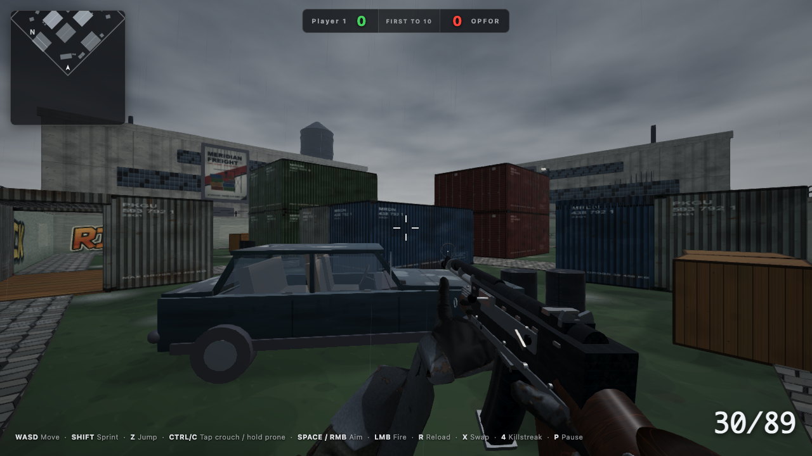

# Fall of Duty

A browser-native 1v1 first-person shooter. You spawn in Ship Box, a rain-soaked container yard, against one computer-controlled soldier whose skill you dial from Recruit to Terminator. First to ten kills wins. Built directly with Babylon.js and TypeScript, without a separate game editor. One rigged soldier model supplies the character art; every surface in the yard, every weapon, and every poster is painted procedurally at load.

**[Play it in your browser](https://aj7-iii.github.io/Fall-of-Duty/)**



## Features

- A single opponent with a priority-based behaviour system: perception with a detection meter, hearing, search and hunt, cover-aware attack positions, reload discipline, weapon selection, and human-limited aim that tightens with difficulty
- Ten difficulty levels. Nine and ten turn the opponent into a liquid-metal Terminator with red running lights
- Three weapons with procedural mechanical animation: the MP44 (mag swap, charging handle), the M40A3 bolt rifle (bolt cycle, single-round feed, scope), and the USP .45 (blowback slide, lock-back, mag swap)
- First-person arms cut from the same rigged soldier as the third-person body, posed by inverse kinematics against each weapon's grip points, so the hands match the body you see on the death cam
- Killstreaks: UAV radar at three, an airstrike laptop at five, an Apache gunship at seven
- A staged death: time slows, the body collapses in one of three ways, and a camera designed to avoid wall clipping pulls back to watch
- Physically based materials for the yard and weapons, with painted normal and occlusion/roughness maps, wet surfaces and standing water, and a painted, prefiltered reflection environment
- Three graphics tiers, from native-resolution MSAA and ambient occlusion to a lighter, 60 FPS Fast mode, with automatic step-down when the frame rate can't hold
- Custom callsign, a trash-talking rival with voice lines that can be muted in the settings, kill feed, streak callouts, an end-of-match report

## Controls

| Key | Action |
| --- | --- |
| `W A S D` | Move |
| `Shift` | Sprint |
| `Z` | Jump |
| `Ctrl` or `C` | Tap to crouch, hold to go prone |
| `Space` or right mouse | Aim down sights |
| Left mouse | Fire |
| `R` | Reload |
| `X` | Swap weapon |
| `4` | Use a banked killstreak |
| `P` or `Esc` | Pause |

## Run it locally

Use Node **22.13 or newer within Node 22**, or **Node 24+**. Node 20.19+ is also supported by the installed tools. `.nvmrc` selects Node 22; `package.json` records the precise supported ranges.

```bash
npm ci
npm start
```

That starts the Vite dev server on port 3001 and opens the game in your browser. `npm run build` produces a static site in `dist/`, and `npm run preview` serves that build.

Other scripts:

| Script | What it does |
| --- | --- |
| `npm run dev` | Dev server without opening a browser |
| `npm run typecheck` | `tsc --noEmit` |
| `npm test` | Gameplay, lifecycle and bot-system regression tests |
| `npm run test:browser` | Chromium and Firefox browser tests, including the production Pages build |
| `npm run lint` | ESLint over the source and config |
| `npm run format` | Prettier over the source, tests, scripts, styles, HTML and config |
| `npm run check` | Typecheck, regression tests, lint and format check together (what CI runs) |
| `npm run build:pages` | Build for `/Fall-of-Duty/`, with the same bundle checks |
| `npm run check:bundle` | Check an existing build against the JavaScript size budget |

Before running browser tests for the first time:

```bash
npx playwright install chromium firefox
FOD_REAL_POINTER_LOCK=0 npm run test:browser
```

Both CI and the deployment workflow run `npm run check` and the browser tests. Deployment builds and publishes only after those checks pass. Builds enforce a 4 MB total JavaScript budget and a 1.6 MB maximum chunk budget, measured before compression. See [testing and release checks](docs/TESTING.md).

## Browser support and limitations

Use a desktop browser with WebGL, hardware acceleration enabled, a keyboard and a mouse. Browser tests exercise Chromium and Firefox; CI checks native mouse capture, while local tests simulate it to preserve your desktop cursor. Safari and mobile browsers are not part of the verified gameplay matrix; touch and gamepad controls are not implemented.

The game includes one map and an offline bot match, with one opponent by default. There is no network multiplayer or saved match progression. Settings and your callsign are stored locally in the browser.

Death choreography grounds the body on a horizontal plane at its starting height; nearby props can still intersect the fallen body.

The start screen waits for the soldier model and initial scene shaders before enabling Start. If a download or graphics initialization fails, it shows an error and a **Retry Loading** button. Loading times out after 45 seconds. Retry rebuilds the scene, or reloads the page if the game bundle failed to download.

If mouse capture is unavailable, use a supported desktop browser. If WebGL initialization fails, check browser hardware acceleration. If capture is temporarily blocked after Escape, click Resume again after the browser cooldown.

## Graphics settings

Pick a tier on the start screen or in the pause menu:

- **High**: native device pixels (capped at 2x), 4x MSAA, screen-space ambient occlusion, sharpening
- **Balanced**: 1.5x pixel cap, 2x MSAA plus FXAA, sharpening
- **Fast**: up to 1x pixels, capped at a 1920×1080 pixel budget on larger windows; 60 FPS cap; FXAA and colour grading without bloom, film grain, chromatic aberration or sharpening; 75% less rain; radar redraws at up to 20 Hz. Movement, aiming, weapons and enemy logic still update every gameplay frame.

If the measured frame rate averages under 45 FPS for five seconds of play, the game drops one tier and tells you. It skips two seconds of samples after starting, resuming or changing quality to allow shaders to settle. It can step down again if the next tier still struggles; automatic changes do not overwrite your saved preference.

The main scene stops rendering once the start, pause or end menu's background is ready, and redraws after resizing, loading assets or changing graphics. Hidden tabs and unfocused windows stop the main render loop and pause a live match; use Resume when you return. The start-screen operator preview is limited to 15 FPS in Fast and 30 FPS otherwise, and stops when hidden.

For casual play with lower resource use, choose **Fast** and keep the default one opponent. A smaller browser window can further reduce the rendering cost. For local play without the development tooling, run `npm run build` followed by `npm run preview`.

## How the code is laid out

```
src/
  main.ts                 boot, HMR, dev tooling install
  engine/                 Game (match flow, frame loop), Input, Time, DevTools
  player/                 PlayerController (movement, health), CameraRig, DeathCam
  weapons/                weapon state machines, ADS keyframe animator, hitscan
  viewmodels/             procedural first-person weapon meshes, hand poses, ArmsRig
  rendering/              ViewModelRig (sway, recoil, reload choreography), PostProcessing,
                          Effects (flashes, tracers, decals, sound), materials/canvas kit
  bots/                   Bot coordination; BotPerception, BotNavigation and BotCombat;
                          BotNav (nav graph, rays), SoldierBody (skinned
                          rig, hitboxes, IK), TerminatorSkin, BotConfig (difficulty as data)
  anim/                   DeathPerformance (collapse choreography), boneMath (IK, frames)
  world/                  ShipBoxMap, wrecks, targets, WorldMaterials (painted surfaces)
  killstreaks/            UAV, airstrike laptop, Apache
  ui/                     start screen, HUD, minimap, pause and end screens, rival voice
  data/                   weapon tuning and ADS keyframes as JSON
  assets/                 voice clips and the public-path helper
public/models/            the one external asset: a rigged soldier (glTF); its skin is recoloured at runtime
```

Some design points worth knowing before changing things:

- **Materials are frozen where practical.** Lights are pooled from the start to reduce shader changes during ordinary gameplay. Asynchronous textures, graphics changes and newly enabled effects can still require shader work.
- **The soldier is one shared glTF.** Bots, the player's corpse, and the first-person arms all instantiate it. The arms trim their own copy of the mesh to the arm bone chains and pose the first-person skeleton procedurally. Third-person soldiers blend the model's baked Idle, Walk and Run clips with procedural aim, hand IK and death poses. The skin is the model's own albedo read back from the GPU and recoloured per faction (olive OPFOR, slate player), so every strap and plate edge survives.
- **Bots move through the player's physics.** One kinematic solver serves both, so the opponent obeys exactly the movement rules you do.
- **Difficulty is data.** `BotConfig.ts` holds five named presets; the 1 to 10 slider interpolates between them.

## Dev tooling

In a dev build the console exposes `fod`, which can freeze the loop, step exact frames, save full-resolution captures to `.screenshots/`, switch weapons, tune the arm rig and hand poses live, orbit the first-person rig to inspect it, kill the player to replay the death cam, and report frame timings. See `src/engine/DevTools.ts` for the list. The screenshots come back through a dev-only endpoint in `vite.config.ts`.

## Credits

Built in a two-day sprint by AJ7-III with the initial Claude Fable 5 release, then overhauled. The soldier is Mixamo's Vanguard character, recoloured in code; every other visual is generated in code. Voice lines were recorded for this project.

## License and asset terms

The project's original code, documentation, procedural art and project-owned voice recordings use the [MIT license](LICENSE). The Mixamo soldier, its embedded textures and its animation clips are excluded from MIT and retain Adobe's terms. Dependency licenses also remain separate. See [third-party notices](THIRD_PARTY_NOTICES.md) for sources, terms and the limits of the recorded asset provenance.

Production builds copy the project license and asset notices into `dist/`, with Babylon's licenses and attribution in `dist/LICENSES/`.
